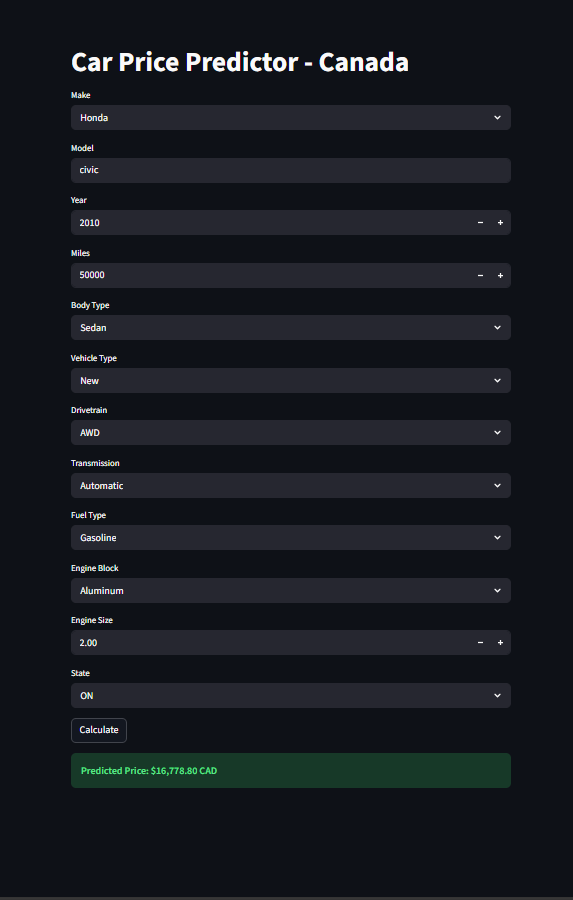

# Car Price Predictor - Canada 🚗🇨🇦
Car Price Predictor for Canadian Market using Python, Scikit-learn & Streamlit

**🚀 Live Demo:** https://car-price-predictor-canada-bqn9kmvr5usjyaxeadsjh2.streamlit.app

### Screenshot


### Tech Stack
- Python
- Scikit-learn 
- Pandas, NumPy
- Streamlit

### Features
- Predicts used car prices based on Make, Model, Year, Miles, Body Type, etc.
- Interactive web app deployed on Streamlit Cloud
- Trained on Canadian car market data

### How to Run Locally
```bash
pip install -r requirements.txt
streamlit run app.py
